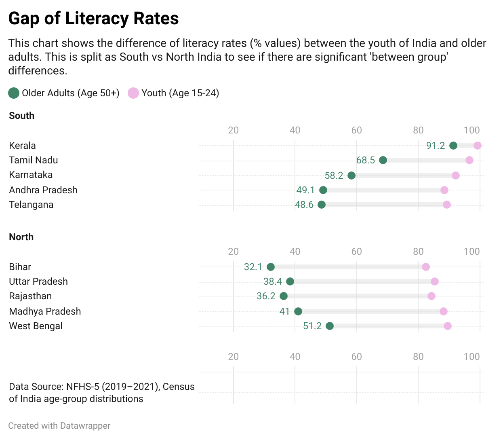
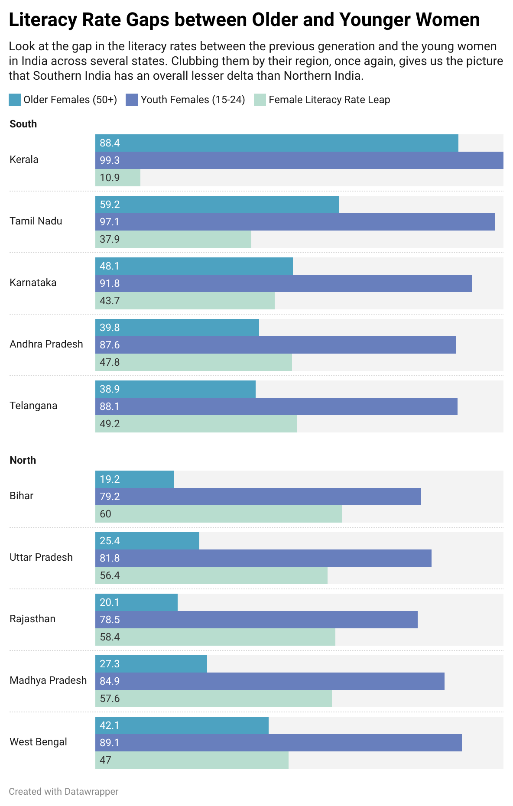

# Cool Visualizations Portfolio
A collection of data visualization mini-projects exploring social trends, sports history, art, and public data.

## 1. The Inter-Generational Literacy Jump in India:
This visualization explores the shift in literacy rates between older adults (**Ages 50+**) and today's youth (**Ages 15–24**) across Northern vs. Southern Indian states using **NFHS-5 data**.

*Click the image above to open the live interactive visualization.*

### Key Insights
* **The Northern Surge:** States like Bihar and Uttar Pradesh demonstrate an inter-generational jump of nearly **+50 percentage points**, with youth literacy reaching over 80%.
* **Southern Stability:** Southern states like Kerala and Tamil Nadu show smaller numeric jumps because their older-generation baselines were already significantly higher.

## 2. The Difference of Literacy Rates between Women of Different Generations in India:
Look at the gap in the literacy rates between the previous generation and the young women in India across several states. 

*Click the image above to open the live interactive visualization.*

### Key Insights:
* Clubbing them by their region, once again, gives us the picture that Southern India has an overall lesser delta than Northern India.

*Built with Datawrapper | Part of the Self-Study 2-Hour Visualization Series*

